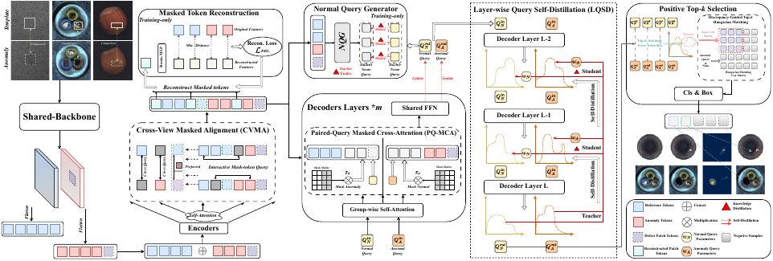
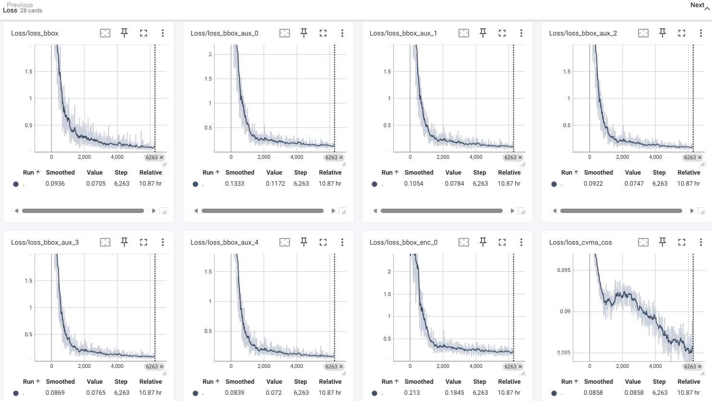
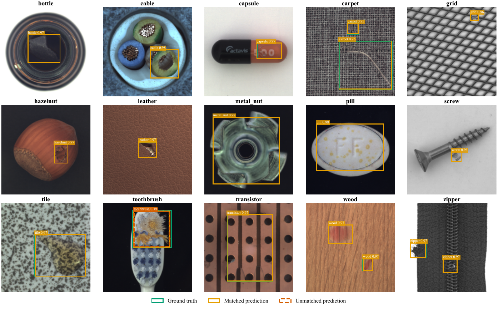

# TEM-DETR

Template-guided industrial defect detection.

## Model Framework

TEM-DETR uses aligned normal templates to guide defect representation learning and query selection.

[](assets/tem_detr_framework.pdf)

## Minimal Reproduction Logs

The [TensorBoard logs in `summary/`](summary/) record a minimal reproduction using this project on the test dataset. A sample of the loss curves is shown below.



## Detection Results

Qualitative results on all 15 MVTec AD categories using TEM-DETR-R50.

[](assets/mvtec_detection_results.pdf)

## Installation

```bash
conda create -n tem-detr python=3.11 -y
conda activate tem-detr
pip install -r requirements.txt
```

Install a CUDA-compatible PyTorch build separately when using a GPU.

## Data

Use COCO bounding-box annotations and provide one spatially aligned normal template for each defective image.

```text
data/
├── images/
├── normal/
└── annotations/
    ├── train.json
    └── val.json
```

Each COCO image record should include a `normal_file_name` path relative to `data/normal/`.

```bash
python tools/prepare_config.py --data-root /path/to/paired_dataset --output configs/local.yml

```

## Training

```bash
python -u tools/train.py -c configs/local.yml -d cuda --seed 42 --output-dir outputs/tem_detr -u epoches=50

export CUDA_VISIBLE_DEVICES=0,1,2,3
python -m torch.distributed.launch --nproc_per_node=4 tools/prepare_config.py --data-root /path/to/paired_dataset --output configs/local.yml
```

```bash
python -u tools/train.py -c configs/local.yml -d cuda --test-only -r /path/to/checkpoint.pth
```

## Configuration Paths

```text
configs/tem/tem_anomaly_only_mvtec.yml  # ResNet-50-vd
configs/tem/tem_r18.yml                 # ResNet-18-vd
configs/tem/tem_r34.yml                 # ResNet-34-vd
configs/tem/tem_r101.yml                # ResNet-101-vd
configs/tem/tem_swin_t.yml              # Swin-T
configs/tem/tem_vit_b16.yml             # ViT-B/16
configs/tem/tem_hgnetv2_l.yml           # HGNetv2-L
configs/tem/tem_hgnetv2_x.yml           # HGNetv2-X
configs/tem/tem_hgnetv2_h.yml           # HGNetv2-H
```

## Main Paths

```text
src/zoo/tem_rtdetr.py
src/zoo/tem_modules/
tools/train.py
tools/prepare_config.py
```
